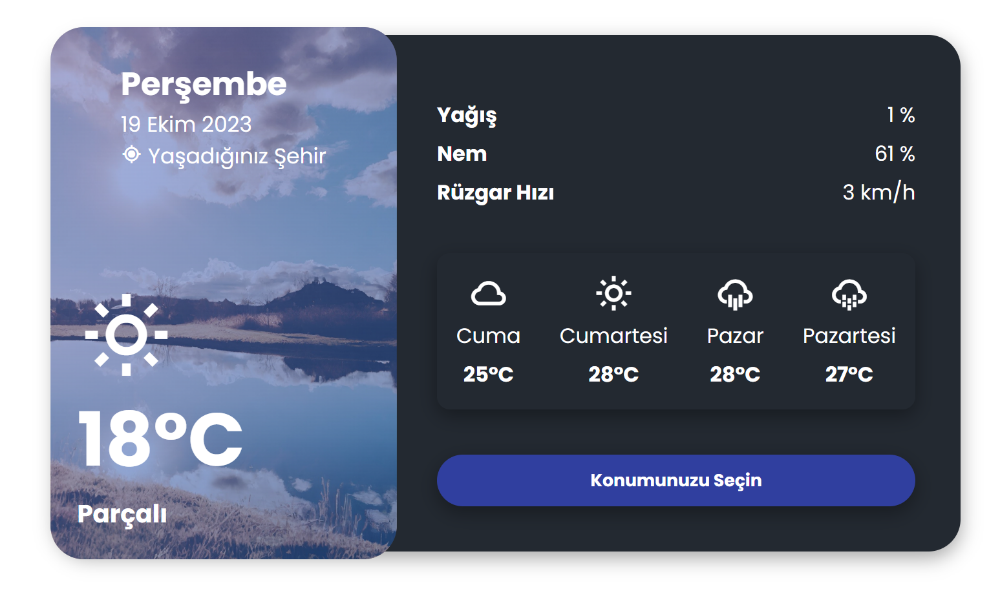

# Hava Durumu UI/UX APP v1.0

Siteyi görüntülemek [için](https://ahmetakifcetin-eb015.web.app/) ziyaret edebilirsiniz.



Kullanıcı arayüzü optimizasyonlu Hava Durumu Takip uygulaması [Ahmet Akif Çetin](https://github.com/ahmetakifcetin) tarafından geliştirilmiştir ve 2023 yılında oluşturulmuştur.

## Özellikler

- Günlük hava durumu bilgileri
- Haftalık hava durumu tahminleri
- Konumunuza göre otomatik hava durumu güncellemeleri

## Kullanım

Uygulamayı kullanmak için aşağıdaki adımları takip edebilirsiniz:

1. Projeyi klonlayın:

   ```bash
   git clone https://github.com/ahmetakifcetin/hava-durumu-uygulamasi.git
   

2. Proje dizinine gidin:
   ```bash
    cd hava-durumu-uygulamasi

3. Tarayıcıda index.html dosyasını açın.

## API Nasıl kullanılır

1. Geliştirici hesabınızdan apı keyinizi aldıktan sonra. "script.js" içerisindeki apıKey="Buraya" yapıştırın:

   ```bash
         const apiKey = ""; //API Keyinizi (Kimseyle Paylaşmayınız.)


2. Eğer ki izleme tek bir bölge olacak ise bölgenizin ID bilgisini almanız gerekir. Alırsanız apiUrl="Buraya" yapıştırın.

      ```bash
         const apiUrl = "http://dataservice.accuweather.com/forecasts/v1/daily/5day/"; //Lokasyon ID hava durumu sayfasından alabilirsiniz 5 Günlük API için önrek kullanım 

3. API Key aldığınız sağlayıcıdan GET isteği gönderin.

4. "Başarılı" mesajını aldıktan sonra Node.js ya da JSON kullanarak çalıştırın.

## Lisans

Bu proje MIT Lisansı altında lisanslanmıştır. Detaylı bilgi için lisans dosyasını inceleyebilirsiniz.

© 2023 Ahmet Akif Çetin. Tüm hakları saklıdır.
